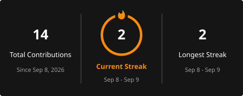

<div align="center">

<a href="https://github.com/Milesden">
  
</a>


# MILESDEN

### `Python Developer` · `AI / ML` · `Backend`

<p>
  <a href="https://github.com/Milesden?tab=repositories">
    
  </a>
  <a href="https://github.com/Milesden">
    
  </a>
</p>

</div>

---

## `> whoami`

```text
Milesden

Python developer focused on backend, automation and AI/ML.
I like building things that actually work — from Telegram bots
to deployable applications and infrastructure.

Currently learning, experimenting and shipping.
```

---

## ⚡ What I do

- 🐍 **Python** — bots, automation, backend
- 🤖 **AI / ML** — learning and building projects
- 🎮 **Game logic** — card-game / Telegram projects
- 🧩 **Backend** — APIs and application architecture
- 🐳 **DevOps** — Docker, CI/CD, cloud deployment
- ☁️ **Infrastructure** — Kubernetes, Terraform, Ansible
- ⚙️ **Other languages** — C++, C#, Java

---

## 🧰 Tech Stack

<p align="center">
  
</p>

---

## 🚀 Featured Projects

<table>
<tr>
<td width="50%">

### 🎴 `durak_bot`

Telegram card game built with **Python + Aiogram**.

**Features**
- Multiplayer game logic
- Callback / inline interactions
- Custom keyboards
- Telegram Bot API
- Deployment-ready structure

<a href="https://github.com/Milesden/durak_bot">
  
</a>

</td>
<td width="50%">

### 💬 `telegram dating bot`

Interactive Telegram bot concept with:

- Invite flow
- Yes / No buttons
- Media & animations
- Conversation states
- Aiogram handlers

**Stack:** Python · Aiogram · Telegram Bot API

</td>
</tr>
</table>

---

## 📊 GitHub

<div align="center">





</div>

<br>

<div align="center">



</div>

---

## 🐍 Contribution Snake

<div align="center">


</div>

---

## 🏆 Achievements

<div align="center">


</div>

---

## 📈 Contribution Graph



---

<div align="center">

### `BUILD • BREAK • LEARN • REPEAT`

<br>


</div>
